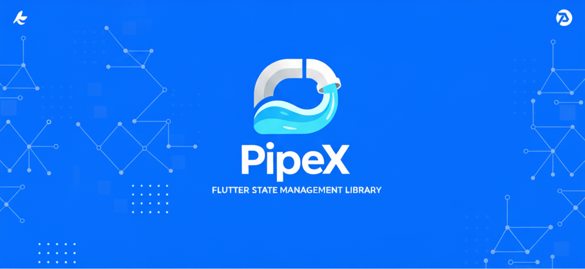

# 🔧 Pipe State Management

**PipeX** is a Flutter library designed for state management, utilizing pipeline architecture. It focuses on precise reactivity and streamlined code to enhance development.




<!-- Start of Selection -->

<p align="center">
  <br>
  <a href="https://pub.dev/packages/pipe_x">
    
  </a>
  <a href="https://github.com/navaneethkrishnaindeed/pipe_x">
    
  </a>
  <a href="https://discord.gg/rWKewdGH">
     
  </a>
  <br><br>
</p>

<!-- End of Selection -->
<p align="center">
  <b>
    <span style="font-size:1.25em">
      🚫 No Streams &nbsp; &nbsp;|&nbsp; &nbsp; 🚫 No Dependency Injection &nbsp; &nbsp;|&nbsp; &nbsp; 🚫 No Keys For Widget Updates
    </span>
  </b>
  <br><br>
  <span>
    <i>
      PipeX eliminates boilerplate.<br>
      Just pure, fine-grained reactivity with Dart Object Manipulation and "Dart:ComponentElement" <br>
     
  </span>
</p>

<p align="center">
  <a href="state_benchmark/README.md">
    
  </a>
</p>

</div>

---

## Complete Guide & Technical Documentation

---

## Table of Contents


1. [What is Pipe?](#what-is-pipe)
2. [Philosophy & Core Principles](#philosophy--core-principles)
3. [Architecture & How It Works](#architecture--how-it-works)
4. [Usage Guide](#usage-guide)
5. [Common Patterns](#common-patterns)
6. [Best Practices & Guidelines](#best-practices--guidelines)
7. [Restrictions & Points to Remember](#restrictions--points-to-remember)
8. [Philosophical Principles](#philosophical-principles)
9. [Core Components Deep Dive](#core-components-deep-dive)
10. [Migration Guide](#migration-guide)
11. [Additional Resources](#additional-resources)
12. [License & Credits](#license--credits)

---

## What is Pipe?

**Pipe** is a lightweight, reactive state management library for Flutter that emphasizes:

- **Fine-grained reactivity**: Only the widgets that depend on changed state rebuild
- **Automatic lifecycle management**: No manual cleanup, everything disposes automatically
- **Simplicity**: Minimal boilerplate, intuitive API
- **Type safety**: Full Dart type system support
- **Declarative**: State flows naturally through your widget tree

### Core Metaphor

The library is named **Pipe** after its fundamental primitive. The terminology comes from a plumbing/water metaphor:

- **Pipe<T>**: Like water pipes, they carry values (water) through your application
- **Hub**: A central junction where multiple pipes connect and are managed
- **Sink**: Where the water (values) flows into your UI and causes updates
- **Well**: A deeper reservoir that draws from multiple pipes at once

The library name emphasizes that `Pipe<T>` is the core building block of the entire system.

---

## Philosophy & Core Principles

### 1. **Reactive by Default**

Everything in Pipe is built around the reactive paradigm. When state changes, the UI automatically reflects those changes without manual intervention.

```dart
final counter = Pipe(0);
counter.value++;  // UI automatically updates
```

### 2. **Granular Rebuilds**

Unlike `setState()` which rebuilds entire widgets, Pipe rebuilds only the exact widgets that depend on changed state.

```dart
// Only the Sink widget rebuilds, not the entire Scaffold
Sink(
  pipe: hub.counter,
  builder: (context, value) => Text('$value'),
)
```

### 3. **Automatic Lifecycle Management**

Pipe handles all cleanup automatically:
- Pipes created in Hubs are automatically disposed when the Hub disposes
- Standalone pipes auto-dispose when no subscribers remain
- Subscriptions are automatically managed by Sink/Well widgets

### 4. **Separation of Concerns**

- **Hub**: Business logic and state
- **Pipe**: State container
- **Sink/Well**: UI subscriptions
- **HubProvider**: Dependency injection

### 5. **Immutability Where It Matters, Flexibility Where You Need It**

- Primitives (int, String) can be updated directly: `count.value++`
- Objects can be replaced immutably: `user.value = User(...)`
- Or mutated with explicit notification: `user.value.name = 'John'; user.pump(user.value)`

### 6. **Composition Over Inheritance**

Build complex state by composing simple Pipes rather than creating complex state classes.

---

## Architecture & How It Works

### High-Level Overview

```
┌─────────────────────────────────────────────────────────┐
│                     Widget Tree                         │
│                                                         │
│  ┌───────────────────────────────────────────────────┐  │
│  │         HubProvider<MyHub>                        │  │
│  │  (Dependency Injection & Lifecycle)               │  │
│  │                                                   │  │
│  │    ┌─────────────────────────────────────────┐    │  │
│  │    │         Hub (State Container)           │    │  │
│  │    │                                         │    │  │
│  │    │  Pipe<int> count                        │    │  │
│  │    │  Pipe<String> name                      │    │  │
│  │    │  Pipe<User> user                        │    │  │
│  │    │                                         │    │  │
│  │    │  Methods: increment(), reset(), etc.    │    │  │
│  │    └─────────────────────────────────────────┘    │  │
│  │                    │                              │  │
│  │                    │ Notifies                     │  │
│  │                    ▼                              │  │
│  │    ┌─────────────────────────────────────────┐    │  │
│  │    │   Sink/Well (Reactive Widgets)          │    │  │
│  │    │   - Subscribe to Pipe(s)                │    │  │
│  │    │   - Rebuild on changes                  │    │  │
│  │    │   - Auto cleanup                        │    │  │
│  │    └─────────────────────────────────────────┘    │  │
│  └───────────────────────────────────────────────────┘  │
└─────────────────────────────────────────────────────────┘
```

### State Update Flow

```
User Action
    │
    ▼
Hub Method Called (e.g., increment())
    │
    ▼
Pipe.value = newValue
    │
    ▼
Pipe.shouldNotify(newValue) → true/false
    │ (if true)
    ▼
Pipe.notifySubscribers()
    │
    ▼
All subscribed Elements marked for rebuild
    │
    ▼
Flutter schedules rebuild
    │
    ▼
Sink/Well.build() called
    │
    ▼
UI updated with new value
```

---


## Usage Guide

### Getting Started

#### 1. Create a Hub

```dart
class CounterHub extends Hub {
  // State - automatically registered!
  late final count = Pipe(0);
  
  // Business logic
  void increment() => count.value++;
  void decrement() => count.value--;
  void reset() => count.value = 0;
}
```

#### 2. Provide the Hub

```dart
MaterialApp(
  home: HubProvider(
    create: () => CounterHub(),
    child: CounterScreen(),
  ),
)
```

#### 3. Subscribe in UI

```dart
class CounterScreen extends StatelessWidget {
  @override
  Widget build(BuildContext context) {
    return Scaffold(
      body: Center(
        child: Sink(
          pipe: context.read<CounterHub>().count,
          builder: (context, value) => Text('$value'),
        ),
      ),
      floatingActionButton: FloatingActionButton(
        onPressed: () => context.read<CounterHub>().increment(),
        child: Icon(Icons.add),
      ),
    );
  }
}
```

### When to Use What

#### Sink vs Well

**Use Sink when:**
- You only need to listen to ONE pipe
- You want type safety (Sink<int> is typed)

```dart
Sink<int>(
  pipe: hub.counter,
  builder: (context, value) => Text('$value'),
)
```

**Use Well when:**
- You need to listen to MULTIPLE pipes
- You have computed values that depend on multiple pipes

```dart
Well(
  pipes: [hub.firstName, hub.lastName],
  builder: (context) {
    final hub = context.read<UserHub>();
    return Text('${hub.firstName.value} ${hub.lastName.value}');
  },
)
```

#### Using read()

**Use `context.read<T>()`:**
- In callbacks (button presses, etc.)
- To access Hub methods without triggering rebuilds
- Most common usage for accessing Hubs

```dart
ElevatedButton(
  onPressed: () => context.read<CartHub>().addItem(product),
  child: Text('Add to Cart'),
)
```

For listening to state changes, always use `Sink` or `Well` widgets for granular, targeted rebuilds.

#### Standalone Pipes vs Hub Pipes

**Standalone Pipes** (auto-dispose):
```dart
class MyWidget extends StatefulWidget {
  @override
  State<MyWidget> createState() => _MyWidgetState();
}

class _MyWidgetState extends State<MyWidget> {
  late final counter = Pipe(0);  // Auto-disposes when widget unmounts
  
  @override
  Widget build(BuildContext context) {
    return Sink(
      pipe: counter,
      builder: (context, value) => Text('$value'),
    );
  }
}
```

**Hub Pipes** (Hub manages disposal):
```dart
class MyHub extends Hub {
  late final counter = Pipe(0);  // Hub disposes this
}
```

**When to use standalone:**
- Local widget state that doesn't need to be shared
- Temporary state for a single screen

**When to use Hub:**
- Shared state across multiple widgets
- Business logic
- State that needs lifecycle management

---


## Common Patterns

### Pattern 1: Form Management

```dart
class LoginHub extends Hub {
  late final email = Pipe('');
  late final password = Pipe('');
  late final isLoading = Pipe(false);
  late final error = Pipe<String?>(null);
  
  // Validation (computed)
  bool get isEmailValid => email.value.contains('@');
  bool get isPasswordValid => password.value.length >= 6;
  bool get canSubmit => isEmailValid && isPasswordValid && !isLoading.value;
  
  Future<void> login() async {
    if (!canSubmit) return;
    
    isLoading.value = true;
    error.value = null;
    
    try {
      await authService.login(email.value, password.value);
    } catch (e) {
      error.value = e.toString();
    } finally {
      isLoading.value = false;
    }
  }
}
```

**UI:**
```dart
Well(
  pipes: [hub.email, hub.password, hub.isLoading],
  builder: (context) {
    final hub = context.read<LoginHub>();
    return ElevatedButton(
      onPressed: hub.canSubmit ? () => hub.login() : null,
      child: hub.isLoading.value 
        ? CircularProgressIndicator() 
        : Text('Login'),
    );
  },
)
```

### Pattern 2: Async Data Loading

```dart
class UserProfileHub extends Hub {
  late final user = Pipe<User?>(null);
  late final isLoading = Pipe(false);
  late final error = Pipe<String?>(null);
  
  Future<void> loadUser(String userId) async {
    isLoading.value = true;
    error.value = null;
    
    try {
      final userData = await api.getUser(userId);
      user.value = userData;
    } catch (e) {
      error.value = e.toString();
    } finally {
      isLoading.value = false;
    }
  }
}
```

**UI:**
```dart
Well(
  pipes: [hub.user, hub.isLoading, hub.error],
  builder: (context) {
    final hub = context.read<UserProfileHub>();
    
    if (hub.isLoading.value) return CircularProgressIndicator();
    if (hub.error.value != null) return Text('Error: ${hub.error.value}');
    if (hub.user.value == null) return Text('No user');
    
    return UserCard(user: hub.user.value!);
  },
)
```

### Pattern 3: Computed Values

```dart
class ShoppingCartHub extends Hub {
  late final items = Pipe<List<CartItem>>([]);
  late final taxRate = Pipe(0.08);
  late final couponDiscount = Pipe(0.0);
  
  // All computed via getters
  double get subtotal => items.value.fold(0.0, (sum, item) => sum + item.price);
  double get tax => subtotal * taxRate.value;
  double get discount => subtotal * couponDiscount.value;
  double get total => subtotal + tax - discount;
  
  void addItem(CartItem item) {
    items.value = [...items.value, item];
  }
}
```

**UI:**
```dart
Well(
  pipes: [hub.items, hub.taxRate, hub.couponDiscount],
  builder: (context) {
    final hub = context.read<ShoppingCartHub>();
    return Column(
      children: [
        Text('Subtotal: \$${hub.subtotal.toStringAsFixed(2)}'),
        Text('Tax: \$${hub.tax.toStringAsFixed(2)}'),
        Text('Discount: -\$${hub.discount.toStringAsFixed(2)}'),
        Divider(),
        Text('Total: \$${hub.total.toStringAsFixed(2)}',
          style: TextStyle(fontWeight: FontWeight.bold),
        ),
      ],
    );
  },
)
```

### Pattern 4: Mutable Objects with pump()

```dart
class UserProfile {
  String name;
  int age;
  String bio;
  
  UserProfile({required this.name, required this.age, required this.bio});
}

class ProfileHub extends Hub {
  late final profile = Pipe(UserProfile(
    name: 'John',
    age: 25,
    bio: 'Developer',
  ));
  
  // Mutate and force update
  void updateName(String name) {
    profile.value.name = name;
    profile.pump(profile.value);  // Force rebuild
  }
  
  void incrementAge() {
    profile.value.age++;
    profile.pump(profile.value);
  }
}
```

**Why pump()?** The reference doesn't change, so `shouldNotify()` would return false. `pump()` bypasses this check.

### Pattern 5: Multiple Hubs

```dart
MultiHubProvider(
  hubs: [
    () => AuthHub(),
    () => ThemeHub(),
    () => SettingsHub(),
  ],
  child: MyApp(),
)
```

**Access:**
```dart
final auth = context.read<AuthHub>();
final theme = context.read<ThemeHub>();
final settings = context.read<SettingsHub>();
```

### Pattern 6: Scoped vs Global Hubs

**Global Hub** (survives navigation):
```dart
MaterialApp(
  home: HubProvider(
    create: () => AppStateHub(),  // Lives for app lifetime
    child: HomeScreen(),
  ),
)
```

**Scoped Hub** (disposed on navigation):
```dart
Navigator.push(
  context,
  MaterialPageRoute(
    builder: (_) => HubProvider(
      create: () => EditProductHub(product),  // Disposed on pop
      child: EditProductScreen(),
    ),
  ),
)
```

---

## Best Practices & Guidelines

### 1. Keep Sinks Small

❌ **Bad:**
```dart
Sink(
  pipe: hub.user,
  builder: (context, user) => Scaffold(
    appBar: AppBar(...),
    body: Column(...),  // Entire screen rebuilds
  ),
)
```

✅ **Good:**
```dart
Scaffold(
  appBar: AppBar(
    title: Sink(
      pipe: hub.user,
      builder: (context, user) => Text(user.name),  // Only title rebuilds
    ),
  ),
  body: ProfileBody(),  // Doesn't rebuild
)
```

### 2. Use Getters for Computed Values

❌ **Bad:**
```dart
class CounterHub extends Hub {
  late final count = Pipe(0);
  late final isEven = Pipe(false);  // Redundant state
  
  void increment() {
    count.value++;
    isEven.value = count.value % 2 == 0;  // Manual sync
  }
}
```

✅ **Good:**
```dart
class CounterHub extends Hub {
  late final count = Pipe(0);
  
  bool get isEven => count.value % 2 == 0;  // Computed
  
  void increment() => count.value++;
}
```

### 3. Don't Nest Sink/Well

❌ **Bad:**
```dart
Sink(
  pipe: hub.firstName,
  builder: (context, first) => Sink(  // Nested!
    pipe: hub.lastName,
    builder: (context, last) => Text('$first $last'),
  ),
)
```

✅ **Good:**
```dart
Well(
  pipes: [hub.firstName, hub.lastName],
  builder: (context) {
    final hub = context.read<UserHub>();
    return Text('${hub.firstName.value} ${hub.lastName.value}');
  },
)
```

### 4. Use read() in Callbacks

✅ **Correct:**
```dart
@override
Widget build(BuildContext context) {
  return ElevatedButton(
    onPressed: () => context.read<CounterHub>().increment(),
    child: Text('Increment'),
  );
}
```

This demonstrates using `read()` to access Hub methods without causing rebuilds.

### 5. Separate Business Logic from UI

❌ **Bad:**
```dart
ElevatedButton(
  onPressed: () {
    final cart = context.read<CartHub>();
    final item = cart.items.value.firstWhere((i) => i.id == productId);
    cart.items.value = [...cart.items.value.where((i) => i.id != productId)];
  },
  child: Text('Remove'),
)
```

✅ **Good:**
```dart
// In Hub:
void removeItem(String productId) {
  items.value = items.value.where((i) => i.id != productId).toList();
}

// In UI:
ElevatedButton(
  onPressed: () => context.read<CartHub>().removeItem(productId),
  child: Text('Remove'),
)
```

### 6. Use pump() for Mutable Objects

When using mutable objects:

```dart
// Option 1: Immutable updates (preferred)
user.value = User(
  name: 'John',
  age: user.value.age,
  email: user.value.email,
);

// Option 2: Mutable updates with pump()
user.value.name = 'John';
user.pump(user.value);
```

### 7. Proper Error Handling

```dart
class DataHub extends Hub {
  late final data = Pipe<List<Item>>([]);
  late final isLoading = Pipe(false);
  late final error = Pipe<String?>(null);
  
  Future<void> fetchData() async {
    isLoading.value = true;
    error.value = null;
    
    try {
      final result = await api.getData();
      data.value = result;
    } catch (e) {
      error.value = e.toString();
      // Optionally log to analytics
    } finally {
      isLoading.value = false;  // Always cleanup
    }
  }
}
```

---

## Restrictions & Points to Remember

### Critical Rules

#### 1. **Never Call Methods on Disposed Hubs/Pipes**

```dart
final hub = CounterHub();
hub.dispose();
hub.increment();  // ❌ StateError!
```

**Why**: Disposed objects have cleaned up all resources. This is prevented automatically when using HubProvider.

#### 2. **Don't Create Pipes After Hub Construction**

❌ **Bad:**
```dart
class MyHub extends Hub {
  late final count = Pipe(0);  // ✅ OK
  
  void addCounter() {
    final newCounter = Pipe(0);  // ❌ Won't auto-register!
  }
}
```

**Why**: Auto-registration only works during Hub construction (when Hub is on the stack).

**Solution**: Create all Pipes as `late final` fields.

#### 3. **Always Provide HubProvider Above Usage**

```dart
// ❌ Bad:
class MyApp extends StatelessWidget {
  @override
  Widget build(BuildContext context) {
    return MaterialApp(
      home: Scaffold(
        body: Sink(
          pipe: context.read<CounterHub>().count,  // ❌ No provider!
          builder: (context, value) => Text('$value'),
        ),
      ),
    );
  }
}

// ✅ Good:
class MyApp extends StatelessWidget {
  @override
  Widget build(BuildContext context) {
    return HubProvider(
      create: () => CounterHub(),
      child: MaterialApp(
        home: CounterScreen(),
      ),
    );
  }
}
```

#### 4. **Don't Modify Lists/Maps Directly**

❌ **Bad:**
```dart
items.value.add(newItem);  // Modifies list but doesn't notify!
```

✅ **Good:**
```dart
// Option 1: Create new list
items.value = [...items.value, newItem];

// Option 2: Modify then pump
items.value.add(newItem);
items.pump(items.value);
```

**Why**: `shouldNotify()` checks reference equality. Modifying in place doesn't change the reference.

#### 5. **Avoid Circular Dependencies**

❌ **Bad:**
```dart
class HubA extends Hub {
  late final value = Pipe(0);
  
  void update(HubB hubB) {
    value.value = hubB.value.value;  // Depends on HubB
  }
}

class HubB extends Hub {
  late final value = Pipe(0);
  
  void update(HubA hubA) {
    value.value = hubA.value.value;  // Depends on HubA
  }
}
```

**Solution**: Redesign to have a single source of truth or a parent hub.

#### 6. **Always Use Sink/Well for Listening**

Never access pipe values directly in build - always use `Sink` or `Well` for listening:

```dart
@override
Widget build(BuildContext context) {
  final hub = context.read<CounterHub>();
  
  return Column(
    children: [
      // ✅ Correct: Each Sink rebuilds only when its specific pipe changes
      Sink(pipe: hub.count, 
        builder: (_, value) => Text('$value')),
      Sink(pipe: hub.name,
        builder: (_, value) => Text('$value')),
      ExpensiveWidget(),  // ✅ Never rebuilds unnecessarily
    ],
  );
}
```

### Performance Considerations

#### 1. **Granular Rebuilds**

Pipe's biggest advantage is granular rebuilds. Use it!

```dart
// ❌ Entire list rebuilds
Sink(
  pipe: hub.items,
  builder: (context, items) => ListView.builder(
    itemCount: items.length,
    itemBuilder: (context, index) => ItemTile(items[index]),
  ),
)

// ✅ Only changed items rebuild (if items are in separate pipes)
class ItemsHub extends Hub {
  late final items = Pipe<Map<String, Pipe<Item>>>({});
  
  void updateItem(String id, Item item) {
    items.value[id]?.value = item;  // Only this Pipe notifies
  }
}
```

#### 2. **Avoid Excessive Pipes**

```dart
// ❌ Too granular for simple cases
class UserHub extends Hub {
  late final nameFirst = Pipe('');
  late final nameMiddle = Pipe('');
  late final nameLast = Pipe('');
  late final nameSuffix = Pipe('');
  // ... 50 more fields
}

// ✅ Group related data
class UserHub extends Hub {
  late final name = Pipe(Name(first: '', last: ''));
  late final contact = Pipe(Contact(email: '', phone: ''));
}
```

**Balance**: More pipes = more granular rebuilds, but more complexity.

#### 3. **Use const Widgets**

```dart
Sink(
  pipe: hub.counter,
  builder: (context, value) => Column(
    children: [
      Text('$value'),
      const SizedBox(height: 16),  // ✅ const
      const Divider(),             // ✅ const
    ],
  ),
)
```

### Debugging Tips

#### 1. **Check Subscriber Count**

```dart
print('Hub subscribers: ${hub.subscriberCount}');
print('Pipe subscribers: ${hub.count.subscriberCount}');
```

**Use case**: Understanding rebuild behavior, detecting memory leaks.

#### 2. **Override shouldNotify for Debugging**

```dart
class DebugPipe<T> extends Pipe<T> {
  DebugPipe(T value) : super(value);
  
  @override
  bool shouldNotify(T newValue) {
    final result = super.shouldNotify(newValue);
    print('Should notify? $result (old: $_value, new: $newValue)');
    return result;
  }
}
```

#### 3. **Hot Reload Behavior**

Pipe handles hot reload gracefully:
- Hubs are recreated
- Pipes are recreated
- Subscriptions are re-established

**Important**: Your data will reset on hot reload. Use `debugRestoreState` pattern if needed.

### Testing

#### Unit Testing Hubs

```dart
test('CounterHub increments', () {
  final hub = CounterHub();
  
  expect(hub.count.value, 0);
  
  hub.increment();
  expect(hub.count.value, 1);
  
  hub.increment();
  expect(hub.count.value, 2);
  
  hub.dispose();  // Cleanup
});
```

#### Testing Pipes

```dart
test('Pipe notifies on value change', () {
  final pipe = Pipe(0);
  int notifyCount = 0;
  
  pipe.addListener(() => notifyCount++);
  
  pipe.value = 1;
  expect(notifyCount, 1);
  
  pipe.value = 1;  // Same value
  expect(notifyCount, 1);  // Shouldn't notify
  
  pipe.pump(1);  // Force
  expect(notifyCount, 2);
  
  pipe.dispose();
});
```

#### Widget Testing

```dart
testWidgets('Sink rebuilds on pipe change', (tester) async {
  final hub = CounterHub();
  
  await tester.pumpWidget(
    MaterialApp(
      home: HubProvider(
        create: () => hub,
        child: Sink(
          pipe: hub.count,
          builder: (context, value) => Text('$value'),
        ),
      ),
    ),
  );
  
  expect(find.text('0'), findsOneWidget);
  
  hub.increment();
  await tester.pump();
  
  expect(find.text('1'), findsOneWidget);
});
```

---

## Philosophical Principles

### 1. **Simplicity Over Cleverness**

Pipe values straightforward, readable code over complex abstractions.

```dart
// Simple and clear
class CounterHub extends Hub {
  late final count = Pipe(0);
  void increment() => count.value++;
}

// Over-engineered
class CounterHub extends Hub with LoggingMixin, AnalyticsMixin {
  @observable late final count = createTrackedPipe(0);
  @action void increment() => performAction(() => count.value++);
}
```

### 2. **Explicit Over Implicit**

Pipe prefers explicit subscriptions (Sink/Well) over implicit ones (automatic tracking).

**Why?** 
- Clear what rebuilds when
- Easier to debug
- Better performance (no hidden subscriptions)

### 3. **Local State by Default**

Prefer local state (in widgets) over global state (in Hubs) when possible.

```dart
// If only one widget needs it:
class MyWidget extends StatefulWidget {
  @override
  State<MyWidget> createState() => _MyWidgetState();
}

class _MyWidgetState extends State<MyWidget> {
  late final expanded = Pipe(false);  // Local
}

// If multiple widgets need it:
class MyHub extends Hub {
  late final expanded = Pipe(false);  // Shared
}
```

### 4. **Composition Over Complexity**

Build complex behavior from simple Pipes rather than creating complex Pipe types.

```dart
// ✅ Good: Compose simple Pipes
class FormHub extends Hub {
  late final email = Pipe('');
  late final password = Pipe('');
  
  bool get isValid => email.value.contains('@') && password.value.length >= 6;
}

// ❌ Avoid: Complex custom Pipe types
class ValidatedPipe<T> extends Pipe<T> {
  final bool Function(T) validator;
  final void Function(String)? onError;
  // ... complex validation logic
}
```

### 5. **Fail Fast, Fail Loudly**

Pipe throws clear errors immediately rather than failing silently.

```dart
// ❌ Silent failure
if (!_disposed) {
  _value = newValue;
}

// ✅ Loud failure
if (_disposed) {
  throw StateError('Cannot set value on a disposed Pipe');
}
_value = newValue;
```

### 6. **Automatic Resource Management**

You should never have to think about cleanup. Pipe handles it.

- Hubs dispose their Pipes
- HubProvider disposes Hubs
- Standalone Pipes auto-dispose
- Sink/Well auto-unsubscribe

**You never call dispose() manually in normal usage.**

### 7. **Type Safety**

Leverage Dart's type system for correctness.

```dart
Sink<int>(  // Type-safe
  pipe: hub.count,
  builder: (context, int value) => Text('$value'),
)
```

---
## Core Components Deep Dive

### 1. Pipe<T> - The Reactive Container

**Location**: `lib/src/core/pipe.dart`

#### Purpose
`Pipe<T>` is the fundamental building block of Pipe. It holds a value of type `T` and notifies subscribers when the value changes.

#### Key Properties

```dart
class Pipe<T> {
  T _value;                                  // Current value
  Set<ReactiveSubscriber> _subscribers;      // UI elements listening
  List<VoidCallback> _listeners;             // Additional callbacks
  bool _disposed;                            // Lifecycle state
  bool _autoDispose;                         // Auto-cleanup flag
  bool _isRegisteredWithController;          // Hub-managed flag
}
```

#### Core Methods

##### `value` (getter/setter)

```dart
T get value {
  if (_disposed) throw StateError('Cannot access disposed Pipe');
  return _value;
}

set value(T newValue) {
  if (_disposed) throw StateError('Cannot set value on disposed Pipe');
  if (shouldNotify(newValue)) {
    _value = newValue;
    notifySubscribers();
  }
}
```

**How it works:**
1. Checks if pipe is disposed (throws if true)
2. Calls `shouldNotify()` to determine if change is significant
3. Updates internal value
4. Notifies all subscribers to rebuild

##### `shouldNotify(T newValue)` - Change Detection

```dart
bool shouldNotify(T newValue) {
  return _value != newValue;
}
```

**Principle**: Uses Dart's `!=` operator to detect changes. For primitives (int, String), this compares values. For objects, it compares references.

**Why this matters:**
- `count.value = 5` → rebuilds if count wasn't already 5
- `user.value = user.value` → doesn't rebuild (same reference)
- `user.value = User(...)` → always rebuilds (new reference)

##### `pump(T newValue)` - Force Update

```dart
void pump(T newValue) {
  if (_disposed) throw StateError('Cannot update disposed Pipe');
  _value = newValue;
  notifySubscribers();  // ALWAYS notifies, bypassing shouldNotify
}
```

**Use case**: When you mutate an object's internal state without changing the reference:

```dart
user.value.name = 'John';  // Reference unchanged
user.pump(user.value);     // Force rebuild
```

##### `notifySubscribers()` - The Notification Engine

```dart
void notifySubscribers() {
  if (_isNotifying) return;  // Prevent recursion
  
  _isNotifying = true;
  try {
    // Create copy to avoid concurrent modification
    final subscribersCopy = List.of(_subscribers);
    subscribersCopy.forEach((subscriber) {
      if (subscriber.mounted) {
        final element = subscriber as Element;
        if (element.mounted) {
          element.markNeedsBuild();  // Flutter's rebuild mechanism
        }
      }
    });
    
    // Notify additional listeners
    final listenersCopy = List.of(_listeners);
    for (final listener in listenersCopy) {
      listener();
    }
  } finally {
    _isNotifying = false;
  }
}
```

**Principles:**
1. **Guard against recursion**: `_isNotifying` flag prevents infinite loops
2. **Safe iteration**: Creates copies to handle subscriptions changing during notification
3. **Mounted check**: Only rebuilds widgets still in the tree
4. **Flutter integration**: Calls `markNeedsBuild()` which integrates with Flutter's build pipeline

##### `attach(ReactiveSubscriber)` / `detach(ReactiveSubscriber)` - Subscription Management

```dart
void attach(ReactiveSubscriber subscriber) => _subscribers.add(subscriber);

void detach(ReactiveSubscriber subscriber) {
  _subscribers.remove(subscriber);
  
  // Auto-dispose if enabled and no more subscribers
  if (_autoDispose && 
      !_isRegisteredWithController && 
      _subscribers.isEmpty && 
      _listeners.isEmpty && 
      !_disposed) {
    scheduleMicrotask(() {
      if (_subscribers.isEmpty && _listeners.isEmpty && !_disposed) {
        dispose();
      }
    });
  }
}
```

**Auto-disposal principle**: 
- Standalone pipes (not in a Hub) automatically clean themselves up when the last subscriber leaves
- Uses `scheduleMicrotask` to avoid disposing during iteration
- Double-checks conditions to handle race conditions

#### Auto-Registration with Hubs

```dart
Pipe(this._value, {bool? autoDispose})
    : _autoDispose = autoDispose ?? true {
  _autoRegisterIfNeeded(this);
}

static void _autoRegisterIfNeeded(Pipe pipe) {
  final hub = Hub.current;  // Check if we're in a Hub constructor
  if (hub != null) {
    hub.autoRegisterPipe(pipe);
    pipe._isRegisteredWithController = true;
    pipe._autoDispose = false;  // Hub manages lifecycle
  }
}
```

**How it works:**
1. During Hub construction, the Hub adds itself to a static stack
2. When a Pipe is created, it checks `Hub.current` (top of stack)
3. If a Hub is found, the Pipe registers itself automatically
4. Auto-dispose is disabled (Hub will handle disposal)

---

### 2. Hub - The State Manager

**Location**: `lib/src/core/hub.dart`

#### Purpose
Hub groups related Pipes and manages their lifecycle. It's the central point for business logic and state management.

#### Key Properties

```dart
abstract class Hub {
  bool _disposed;                          // Lifecycle state
  Map<String, Pipe> _pipes;                // Registered pipes
  int _autoRegisterCounter;                // Auto-naming counter
  static List<Hub> _constructionStack;     // For auto-registration
}
```

#### Construction Flow

```dart
Hub() {
  _constructionStack.add(this);
  // Subclass constructor runs here
  // late final fields initialized when first accessed
}
```

**The Magic of Auto-Registration:**

```dart
class CounterHub extends Hub {
  late final count = Pipe(0);  // ← Initialized when first accessed
  // At this moment:
  // 1. Pipe constructor runs
  // 2. Pipe checks Hub.current (finds CounterHub on stack)
  // 3. Pipe calls hub.autoRegisterPipe(this)
  // 4. Pipe is now tracked for disposal
}
```

#### Core Methods

##### `completeConstruction()` - Lifecycle Management

```dart
void completeConstruction() {
  _constructionStack.remove(this);
}
```

**Why this exists**: After the Hub is fully constructed, we remove it from the stack so that standalone Pipes created later won't accidentally register.

Called by `HubProvider` automatically.

##### `autoRegisterPipe(Pipe pipe)` - Automatic Registration

```dart
void autoRegisterPipe(Pipe pipe) {
  if (_disposed) throw StateError('Cannot register pipe on disposed hub');
  final key = '_auto_${_autoRegisterCounter++}';
  _pipes[key] = pipe;
}
```

**Automatic naming**: Each pipe gets a unique key, so you don't need to provide one.

##### `dispose()` - Cleanup

```dart
void dispose() {
  if (_disposed) return;  // Idempotent
  _disposed = true;
  
  // Dispose all registered pipes
  for (final pipe in _pipes.values) {
    pipe.dispose();
  }
  _pipes.clear();
  
  onDispose();  // Custom cleanup hook
}
```

**Disposal cascade**: When a Hub disposes, all its Pipes dispose, which clears all subscriptions. This is why you never need to manually clean up Pipes in a Hub.

##### `subscriberCount` - Debugging Helper

```dart
int get subscriberCount {
  return _pipes.values.fold(0, (sum, pipe) => sum + pipe.subscriberCount);
}
```

**Use case**: Understanding how many widgets are currently subscribed to this Hub's state.

#### Design Pattern: Business Logic Container

```dart
class ShoppingCartHub extends Hub {
  // State
  late final items = Pipe<List<Product>>([]);
  late final discount = Pipe(0.0);
  
  // Computed values (getters)
  double get subtotal => items.value.fold(0, (sum, item) => sum + item.price);
  double get total => subtotal * (1 - discount.value);
  
  // Business logic (methods)
  void addItem(Product product) {
    items.value = [...items.value, product];
  }
  
  void applyDiscount(double percent) {
    discount.value = percent.clamp(0.0, 1.0);
  }
  
  // Lifecycle
  @override
  void onDispose() {
    // Custom cleanup (e.g., cancel timers, close streams)
  }
}
```

---

### 3. Sink<T> - Single Pipe Subscriber

**Location**: `lib/src/widgets/sink.dart`

#### Purpose
`Sink` is a widget that subscribes to a single `Pipe` and rebuilds when that pipe's value changes.

#### Structure

```dart
class Sink<T> extends Widget {
  final Pipe<T> pipe;
  final Widget Function(BuildContext context, T value) builder;
}
```

#### How It Works

The actual work happens in `SinkElement`:

```dart
class SinkElement<T> extends ComponentElement implements ReactiveSubscriber {
  Pipe<T>? _currentPipe;
  
  @override
  void mount(Element? parent, Object? newSlot) {
    super.mount(parent, newSlot);
    _currentPipe = widget.pipe;
    _currentPipe!.attach(this);  // Subscribe
  }
  
  @override
  void update(Sink<T> newWidget) {
    final oldPipe = _currentPipe;
    final newPipe = newWidget.pipe;
    
    if (oldPipe != newPipe) {
      oldPipe?.detach(this);     // Unsubscribe from old
      newPipe.attach(this);       // Subscribe to new
      _currentPipe = newPipe;
    }
    
    super.update(newWidget);
  }
  
  @override
  void unmount() {
    _currentPipe?.detach(this);   // Cleanup
    _currentPipe = null;
    super.unmount();
  }
  
  @override
  Widget build() {
    return widget.builder(this, widget.pipe.value);
  }
}
```

**Lifecycle Integration:**
1. **Mount**: Subscribes to pipe
2. **Update**: Handles pipe changes (rare, but important for hot reload)
3. **Unmount**: Unsubscribes (prevents memory leaks)
4. **Build**: Reads current value and builds UI

**ReactiveSubscriber Interface:**
- `Sink` implements this through `SinkElement`
- When `pipe.notifySubscribers()` is called, it calls `markNeedsBuild()` on the element
- Flutter then schedules a rebuild

---

### 4. Well - Multiple Pipe Subscriber

**Location**: `lib/src/widgets/well.dart`

#### Purpose
`Well` subscribes to multiple `Pipe`s and rebuilds when ANY of them change. Avoids nested `Sink` widgets.

#### Structure

```dart
class Well extends Widget {
  final List<Pipe> pipes;  // Note: Not typed, accepts any Pipe<T>
  final Widget Function(BuildContext context) builder;
}
```

#### How It Works

```dart
class WellElement extends ComponentElement implements ReactiveSubscriber {
  List<Pipe>? _currentPipes;
  
  @override
  void mount(Element? parent, Object? newSlot) {
    super.mount(parent, newSlot);
    _currentPipes = widget.pipes;
    for (final pipe in _currentPipes!) {
      pipe.attach(this);  // Subscribe to all
    }
  }
  
  @override
  void update(Well newWidget) {
    final oldPipes = _currentPipes!;
    final newPipes = newWidget.pipes;
    
    // Unsubscribe from removed pipes
    for (final oldPipe in oldPipes) {
      if (!newPipes.contains(oldPipe)) {
        oldPipe.detach(this);
      }
    }
    
    // Subscribe to new pipes
    for (final newPipe in newPipes) {
      if (!oldPipes.contains(newPipe)) {
        newPipe.attach(this);
      }
    }
    
    _currentPipes = newPipes;
    super.update(newWidget);
  }
  
  @override
  void unmount() {
    for (final pipe in _currentPipes!) {
      pipe.detach(this);  // Cleanup all
    }
    _currentPipes = null;
    super.unmount();
  }
  
  @override
  Widget build() {
    return widget.builder(this);
  }
}
```

**Smart Subscription Management:**
- Only subscribes to pipes that were added
- Only unsubscribes from pipes that were removed
- Minimizes unnecessary subscription churn

**When ANY pipe changes:**
1. `pipe.notifySubscribers()` is called
2. `WellElement.markNeedsBuild()` is called
3. Flutter rebuilds the `Well`
4. Builder has access to ALL pipe values

---

### 5. HubProvider - Dependency Injection

**Location**: `lib/src/widgets/hub_provider.dart`

#### Purpose
Provides a Hub to the widget tree and manages its lifecycle.

#### Structure

```dart
class HubProvider<T extends Hub> extends StatefulWidget {
  final T Function() create;
  final Widget child;
}
```

#### How It Works

```dart
class _HubProviderState<T extends Hub> extends State<HubProvider<T>> {
  late T _hub;
  
  @override
  void initState() {
    super.initState();
    _hub = widget.create();
    _hub.completeConstruction();  // Remove from stack
  }
  
  @override
  void dispose() {
    _hub.dispose();  // Cleanup everything
    super.dispose();
  }
  
  @override
  Widget build(BuildContext context) {
    return _InheritedHub<T>(
      hub: _hub,
      child: widget.child,
    );
  }
}
```

**Lifecycle Management:**
1. **Creation**: Hub created in `initState()`
2. **Construction complete**: Removed from stack so standalone pipes work
3. **Disposal**: Hub disposed in `dispose()`, cascading to all pipes

#### InheritedWidget Integration

```dart
class _InheritedHub<T extends Hub> extends InheritedWidget {
  final T hub;
  
  @override
  bool updateShouldNotify(_InheritedHub<T> oldWidget) {
    return hub != oldWidget.hub;  // Only if instance changes
  }
}
```

**Why InheritedWidget?**
- Efficient lookup up the widget tree
- Flutter's built-in mechanism for dependency injection
- Only notifies dependents if the Hub instance changes (rare)

#### Access Methods

##### `HubProvider.of<T>(context)` - With Dependency

```dart
static T of<T extends Hub>(BuildContext context) {
  final provider = context.dependOnInheritedWidgetOfExactType<_InheritedHub<T>>();
  if (provider != null) return provider.hub;
  
  // Fallback: Check MultiHubProvider...
  
  throw StateError('No HubProvider<$T> found in context.');
}
```

**Creates a dependency**: If you call this in `build()`, the widget will rebuild if the Hub instance changes.

##### `HubProvider.read<T>(context)` - Without Dependency

```dart
static T read<T extends Hub>(BuildContext context) {
  final provider = context.getInheritedWidgetOfExactType<_InheritedHub<T>>();
  if (provider != null) return provider.hub;
  
  // Fallback: Check MultiHubProvider...
  
  throw StateError('No HubProvider<$T> found in context.');
}
```

**No dependency**: Widget won't rebuild when Hub changes. Use in callbacks.

**Key Difference:**
- `dependOnInheritedWidgetOfExactType` → creates dependency
- `getInheritedWidgetOfExactType` → no dependency

---

### 6. BuildContext Extensions

**Location**: `lib/src/extensions/build_context_extension.dart`

#### Purpose
Convenience methods for accessing Hubs.

```dart
extension HubBuildContextExtension on BuildContext {
  T read<T extends Hub>() => HubProvider.read<T>(this);
}
```

**Usage:**
```dart
// Instead of:
HubProvider.read<CounterHub>(context).increment();

// Write:
context.read<CounterHub>().increment();
```

---

### 7. MultiHubProvider - Multiple Hubs

**Location**: `lib/src/widgets/multi_hub_provider.dart`

#### Purpose
Provide multiple Hubs without nesting.

```dart
class MultiHubProvider extends StatelessWidget {
  final List<Hub Function()> hubs;
  final Widget child;
  
  @override
  Widget build(BuildContext context) {
    Widget current = child;
    
    // Wrap in reverse order
    for (int i = hubs.length - 1; i >= 0; i--) {
      current = _HubProviderWrapper(
        create: hubs[i],
        child: current,
      );
    }
    
    return current;
  }
}
```

**How it works:**
1. Creates a chain of `_HubProviderWrapper` widgets
2. Each wrapper manages one Hub
3. Uses dynamic `_InheritedHubDynamic` for type flexibility

**Dynamic Type Handling:**
Since we don't know the Hub types at compile time, `MultiHubProvider` uses a dynamic `InheritedWidget` and runtime type checking.

---

### 8. ReactiveSubscriber Interface

**Location**: `lib/src/core/reactive_subscriber.dart`

#### Purpose
Decouples Pipe from Flutter's Element implementation.

```dart
abstract class ReactiveSubscriber {
  void markNeedsBuild();
  bool get mounted;
}
```

**Why this exists:**
- `Pipe` doesn't need to import Flutter's Element
- Testability: Can mock subscribers
- Flexibility: Any class can implement this interface

**Implementation:**
Both `SinkElement` and `WellElement` implement this interface, allowing Pipes to notify them without knowing they're Flutter elements.

---

## Migration Guide

### From setState

**Before:**
```dart
class CounterScreen extends StatefulWidget {
  @override
  State<CounterScreen> createState() => _CounterScreenState();
}

class _CounterScreenState extends State<CounterScreen> {
  int _count = 0;
  
  void _increment() {
    setState(() => _count++);
  }
  
  @override
  Widget build(BuildContext context) {
    return Column(
      children: [
        Text('$_count'),
        ElevatedButton(onPressed: _increment, child: Text('+')),
      ],
    );
  }
}
```

**After:**
```dart
class CounterHub extends Hub {
  late final count = Pipe(0);
  void increment() => count.value++;
}

class CounterScreen extends StatelessWidget {
  @override
  Widget build(BuildContext context) {
    return Column(
      children: [
        Sink(
          pipe: context.read<CounterHub>().count,
          builder: (context, value) => Text('$value'),
        ),
        ElevatedButton(
          onPressed: () => context.read<CounterHub>().increment(),
          child: Text('+'),
        ),
      ],
    );
  }
}
```

### From Provider

**Before:**
```dart
class Counter with ChangeNotifier {
  int _count = 0;
  int get count => _count;
  
  void increment() {
    _count++;
    notifyListeners();
  }
}

// Usage
ChangeNotifierProvider(
  create: (_) => Counter(),
  child: Consumer<Counter>(
    builder: (context, counter, child) => Text('${counter.count}'),
  ),
)
```

**After:**
```dart
class CounterHub extends Hub {
  late final count = Pipe(0);
  void increment() => count.value++;
}

// Usage
HubProvider(
  create: () => CounterHub(),
  child: Sink(
    pipe: context.read<CounterHub>().count,
    builder: (context, value) => Text('$value'),
  ),
)
```

**Key differences:**
- No `notifyListeners()` - automatic
- No `ChangeNotifier` mixin - use `Hub`
- No `Consumer` - use `Sink` or `Well`

### From BLoC

**Before (flutter_bloc package):**
```dart
// Events
abstract class CounterEvent {}
class IncrementEvent extends CounterEvent {}
class DecrementEvent extends CounterEvent {}

// State
class CounterState {
  final int count;
  final bool isEven;
  
  CounterState({required this.count, required this.isEven});
  
  CounterState copyWith({int? count, bool? isEven}) {
    return CounterState(
      count: count ?? this.count,
      isEven: isEven ?? this.isEven,
    );
  }
}

// BLoC
class CounterBloc extends Bloc<CounterEvent, CounterState> {
  CounterBloc() : super(CounterState(count: 0, isEven: true)) {
    on<IncrementEvent>((event, emit) {
      final newCount = state.count + 1;
      emit(state.copyWith(count: newCount, isEven: newCount % 2 == 0));
    });
    
    on<DecrementEvent>((event, emit) {
      final newCount = state.count - 1;
      emit(state.copyWith(count: newCount, isEven: newCount % 2 == 0));
    });
  }
}

// Provider
BlocProvider(
  create: (context) => CounterBloc(),
  child: MyApp(),
)

// Usage in UI
BlocBuilder<CounterBloc, CounterState>(
  builder: (context, state) {
    return Column(
      children: [
        Text('${state.count}'),
        Text(state.isEven ? 'Even' : 'Odd'),
      ],
    );
  },
)

// Actions
ElevatedButton(
  onPressed: () {
    context.read<CounterBloc>().add(IncrementEvent());
  },
  child: Text('+'),
)
```

**After (Pipe):**
```dart
// Hub (combines BLoC + State)
class CounterHub extends Hub {
  late final count = Pipe(0);
  
  // Use getters for derived state - no need for copyWith!
  bool get isEven => count.value % 2 == 0;
  
  // Direct methods instead of events
  void increment() => count.value++;
  void decrement() => count.value--;
}

// Provider
HubProvider(
  create: () => CounterHub(),
  child: MyApp(),
)

// Usage in UI - granular rebuilds!
Column(
  children: [
    // Only rebuilds when count changes
    Sink(pipe: hub.count, builder: (_, count) => Text('$count')),
    
    // Also only rebuilds when count changes (getter evaluated in builder)
    Sink(
      pipe: hub.count,
      builder: (_, count) => Text(hub.isEven ? 'Even' : 'Odd'),
    ),
  ],
)

// Actions
ElevatedButton(
  onPressed: () => context.read<CounterHub>().increment(),
  child: Text('+'),
)
```

**Key differences:**
- ❌ No separate Event classes - just call methods directly
- ❌ No State classes and copyWith boilerplate - use Pipes
- ❌ No emit() - just update Pipe values
- ✅ Use getters for derived state instead of storing in State
- ✅ More granular rebuilds with Sink (BlocBuilder rebuilds entire widget)
- ✅ Less boilerplate, more direct
- ✅ Synchronous by default (simpler mental model)

---


---

## Additional Resources

### Common Questions

**Q: Can I use Pipe with existing state management?**
A: Yes! Pipe doesn't require exclusive usage. Mix with Provider, BLoC, etc.

**Q: How do I persist state?**
A: Add a persistence layer:
```dart
class CounterHub extends Hub {
  late final count = Pipe(await prefs.getInt('count') ?? 0);
  
  void increment() {
    count.value++;
    prefs.setInt('count', count.value);
  }
}
```

**Q: Can I use Pipe outside Flutter?**
A: The core (`Pipe`, `Hub`) works without Flutter. The widgets (`Sink`, `Well`) require Flutter.

**Q: How do I test Hubs?**
A: Hubs are plain Dart classes. Test them like any other class:
```dart
test('hub logic', () {
  final hub = MyHub();
  hub.doSomething();
  expect(hub.someValue.value, expectedValue);
  hub.dispose();
});
```

**Q: What about code generation?**
A: Pipe intentionally avoids code generation to keep things simple. Everything is explicit.

**Q: Can I use Pipe without Hub?**
A: Yes, but you **must manually dispose** the Pipe. Hubs auto-dispose their Pipes, but standalone Pipes don't:

```dart
class MyWidget extends StatefulWidget {
  @override
  State<MyWidget> createState() => _MyWidgetState();
}

class _MyWidgetState extends State<MyWidget> {
  // Create a standalone Pipe
  late final counter = Pipe(0);
  
  void _increment() {
    counter.value++;
  }
  
  @override
  Widget build(BuildContext context) {
    return Column(
      children: [
        // Use with Sink just like Hub Pipes
        Sink(
          pipe: counter,
          builder: (context, count) => Text('Count: $count'),
        ),
        ElevatedButton(
          onPressed: _increment,
          child: Text('+'),
        ),
      ],
    );
  }
  
  @override
  void dispose() {
    // ⚠️ IMPORTANT: You MUST manually dispose standalone Pipes!
    counter.dispose();
    super.dispose();
  }
}
```

**When to use standalone Pipes:**
- Widget-local state that doesn't need to be shared
- Quick prototyping

**When to use Hub:**
- Shared state across widgets
- Business logic
- Automatic disposal ✅ (recommended for most cases)

---

## License & Credits

This documentation covers the Pipe state management library.

**Key Design Inspirations:**
- MobX: Reactivity concepts
- Provider: Dependency injection pattern
- Signals: Fine-grained reactivity
- BLoC: Separation of business logic

**Philosophy**: Take the best ideas from each approach and create something simpler.

---

**End of Documentation**

For examples, see the `example/` directory in the package.
For issues or questions, please file an issue on the repository.

Happy coding with Pipe! 🔧

